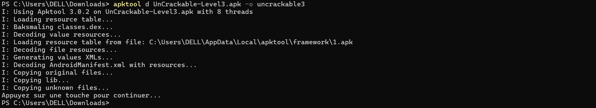
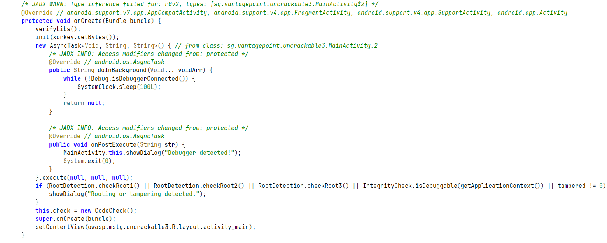
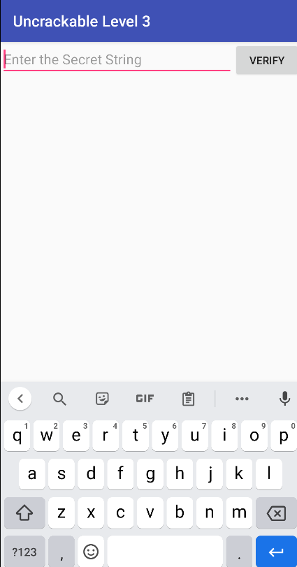
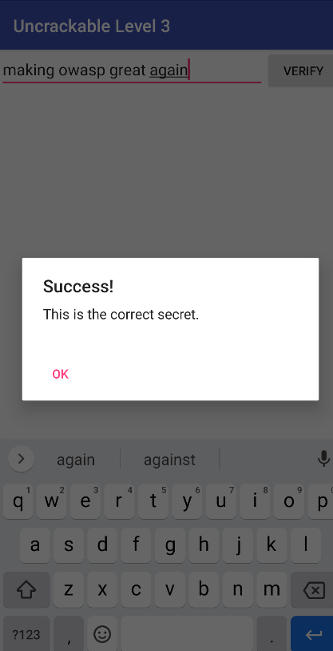

# Rétro-ingénierie de l’APK OWASP Uncrackable Level 3

## 📌 Présentation

Ce laboratoire présente une analyse de sécurité défensive de l’application Android **OWASP Uncrackable Level 3**.

L’objectif est d’étudier les protections intégrées à l’application, contourner les mécanismes de détection root et analyser la logique native afin de retrouver la clé secrète utilisée lors de la validation finale.

---

# 🎯 Objectifs du laboratoire

À la fin de ce TP, l’apprenant sera capable de :

- Identifier les protections Android courantes
- Comprendre les mécanismes Anti-Root
- Comprendre les protections Anti-Debug
- Modifier du bytecode Smali
- Recompiler et signer un APK Android
- Analyser une bibliothèque native `.so`
- Comprendre les techniques d’obfuscation natives
- Extraire et décoder une clé protégée par XOR

---

# ⚖️ Cadre légal et éthique

Ce laboratoire est strictement pédagogique et défensif.

## Autorisé uniquement sur :

- APK de laboratoire
- Applications OWASP de test
- Environnements personnels autorisés
- Émulateurs Android

## Interdit :

- Analyse non autorisée
- Distribution d’APK modifiés
- Utilisation malveillante
- Exploitation offensive

---

# 🧰 Outils utilisés

## Analyse statique

- Jadx-GUI
- apktool
- Visual Studio Code

## Analyse native

- Ghidra

## Outils Android

- adb
- apksigner

## Langages

- Smali
- Python

---

# 🧪 1. Analyse initiale de l’application

Lors du lancement de l’application sur l’émulateur Android, l’application détecte immédiatement un environnement considéré comme compromis.

Le message affiché est :

> “Rooting or tampering detected. This is unacceptable. The app is now going to exit.”

L’application ferme ensuite automatiquement son exécution.

---

# 🔍 2. Analyse du code Java avec Jadx

L’APK a été ouverte dans **Jadx-GUI** afin d’étudier le code Java décompilé.

L’analyse de `MainActivity` montre plusieurs vérifications de sécurité :

```java
checkRoot1()
checkRoot2()
checkRoot3()
isDebuggable()
```

Si une vérification retourne une valeur positive, la méthode :

```java
showDialog()
```

est appelée afin d’afficher l’alerte puis fermer l’application.

---

# 🛠️ 3. Décompilation de l’APK avec apktool

L’application a été décompilée afin d’obtenir :

- le code Smali,
- les ressources Android,
- le manifeste Android.

## Commande utilisée

```bash
apktool d UnCrackable-Level3.apk
```

---

# ✏️ 4. Modification du code Smali

Le fichier :

```text
MainActivity.smali
```

a été ouvert dans Visual Studio Code.

Plutôt que de supprimer chaque vérification individuellement, la méthode :

```smali
showDialog()
```

a été neutralisée directement.

Le patch appliqué consiste à forcer :

```smali
return-void
```

Ainsi, même si les contrôles détectent un environnement rooté, l’alerte n’est jamais affichée.

---

# 🔨 5. Reconstruction et signature de l’APK

Une fois les modifications terminées, l’APK doit être reconstruite.

## Reconstruction

```bash
apktool b uncrackable3 -o UnCrackable-Level3-patched.apk
```

---

## Signature de l’APK

```bash
apksigner sign --ks debug.keystore UnCrackable-Level3-patched.apk
```

---

## Installation

```bash
adb install -r UnCrackable-Level3-patched.apk
```

Après installation, l’application démarre sans afficher l’alerte de sécurité.

---

# 🧬 6. Analyse native de libfoo.so

L’étude du code Java montre que la validation finale est déléguée à une bibliothèque native :

```text
libfoo.so
```

Cette bibliothèque a été analysée sous **Ghidra**.

---

# 🔒 Techniques d’obfuscation observées

La fonction principale :

```text
FUN_001012c0
```

utilise plusieurs mécanismes d’obfuscation :

- Control Flow Flattening
- Faux blocs logiques
- Allocations mémoire inutiles
- Calculs parasites de type LCG
- Structures artificielles

---

# 🔑 Protection de la clé secrète

La clé n’est jamais stockée en clair dans le binaire.

Elle est reconstruite dynamiquement puis comparée octet par octet via une opération XOR.

## Données encodées récupérées

```text
1d 08 11 13 0f 17 49 15 0d 00 03 19 5a 1d 13 15 08 0e 5a 00 17 08 13 14
```

---

# 🐍 7. Déchiffrement de la clé

La clé XOR utilisée est :

```text
pizzapizzapizzapizzapizzapizza
```

## Script Python utilisé

```python
encoded = bytes.fromhex(
    "1d0811130f1749150d0003195a1d1315080e5a0017081314"
)

xor_key = b"pizzapizzapizzapizzapizzapizza"

secret = bytes(a ^ b for a, b in zip(encoded, xor_key))

print("Clé secrète trouvée :", secret.decode())
```

---

# ✅ Résultat obtenu

```text
making owasp great again
```

---

# 📚 Observations techniques

## Rôle du JNI

La fonction Java :

```java
check.check_code()
```

sert uniquement d’interface JNI.

La logique réelle de validation se trouve dans :

```text
FUN_001012c0
```

---

# 🛡️ Intérêt de la logique native

Déplacer les mécanismes sensibles vers du code C/C++ permet :

- une obfuscation avancée,
- des protections anti-analyse,
- une rétro-ingénierie plus complexe,
- un contrôle mémoire plus précis.

---

# 🔐 Améliorations défensives possibles

Le développeur pourrait renforcer davantage la sécurité via :

- White-Box Cryptography
- Vérification du certificat de signature
- Génération dynamique de clé
- Liaison de la clé à l’environnement d’exécution
- Protection mémoire avancée

---

# 📚 Références sécurité

Ce laboratoire s’appuie sur :

- OWASP
- OWASP MASVS
- OWASP MASTG

---

# 📷 Screenshots

## 1. APKTool — Décompilation de l’APK



---

## 2. Analyse de MainActivity dans Jadx



---

## 3. Bypass Root / Application patchée



---

## 4. Script Python de déchiffrement XOR


---

## 5. Validation finale de la clé


